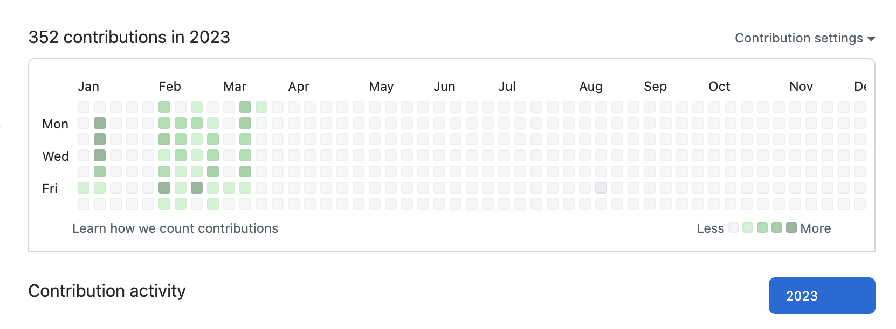

  &nbsp;&nbsp;

## Welcome to my GitHub 👋

### ⭐️ About Me
- A

- B

- C

### 💼 Professional Competencies

- A

- B

- C

### Most Used Languages

### GitHub Stats

### 🔧 Tech & Tools
- OS: macOS Ventura 
- Editor: Visual Studio Code
- Languages: HTML 5, CSS 3, JavaScript
- Libraries: React, Chart.js, Node.js

### Contribution Activity

### Resources Used to Build This Repo:

